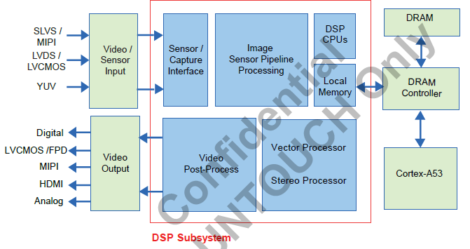

# 1 搭建开发环境
## 1.1 安装交叉编译工具链
&emsp;&emsp;交叉编译工具链在nas服务器上，路径为：  
/nas/users/platform/AMBA_4_CV25_linux_shanhaiguan/tools/Ambarella_Toolchain_Linaro_2020.09.tar.xz。  
&emsp;&emsp;解压此文件，然后运行安装脚本：
```
tar pxvf Ambarella_Toolchain_Linaro_2020.09.tar.xz
cd Ambarella_Toolchain_Linaro_2020.09
sudo ./ubuntuToolChain-linux5.4-202008
```
这样交叉编译工具链就安装完成。
## 1.2 clone工程的仓库
仓库地址为：http://192.168.1.124/liyunlong/shg_amba_cv25_sdk_3_0_2  
## 1.3 source build.sh
进入shg_amba_cv25_sdk_3_0_2/cv25_linux_sdk_3.0.2/ambarella/boards/cv25_hazelnut目录，运行source build.sh
```
cd shg_amba_cv25_sdk_3_0_2/cv25_linux_sdk_3.0.2/ambarella/boards/cv25_hazelnut
source build.sh
```
如果出现Check env error, please install mkfs.jffs2genext2fsmkcramfs错误。需要安装这些库：  
mkfs.jffs2：sudo apt-get install mtd-utils  
genext2fs：sudo apt install genext2fs  
mkcramfs：sudo apt-get install mkcramfs  
如果提示缺少crypto，那么就需要安装crypto python库：  
sudo apt-get install python3-crypto  
再次source build.sh，直到没有错误出现，如下所示：
```
============================================================
TOOLCHAIN    PATH: /usr/local/linaro-aarch64-2020.09-gcc10.2-linux5.4
TOOLCHAIN    NANE: aarch64-linux-gnu-gcc
TOOLCHAIN VERSION: 10.2.1
============================================================
#
# configuration written to .config
#
Build Linux-5.4 with cv25_emmc_kernel_config ...
```
## 1.4 编译项目工程
&emsp;&emsp;进入shg_amba_cv25_sdk_3_0_2/cv25_linux_sdk_3.0.2/ambarella/boards/cv25_hazelnut/目录中，运行make命令：
```
cd shg_amba_cv25_sdk_3_0_2/cv25_linux_sdk_3.0.2/ambarella/boards/cv25_hazelnuts
make -j8
```
&emsp;&emsp;编译完成后，终端显示信息如下所示：
```
...
...
/home/public/shg_amba_cv25_sdk_3_0_2/cv25_linux_sdk_3.0.2/ambarella/out/cv25_hazelnut/rootfs/ext4: clean, 3281/3584 files, 427637/457988 blocks
Build Amboot ... 
Build AmBST ...
Build Done
```
&emsp;&emsp;这样就在shg_amba_cv25_sdk_3_0_2/cv25_linux_sdk_3.0.2/ambarella/下生成了out文件夹，里面包含编译生成的镜像和可执行程序，下面烧写步骤中的elf文件就在这个out/文件夹里。
# 2 针对新拿到的板子烧写
## 2.1 安装烧写工具
&emsp;&emsp;烧写工具的路径为：/nas/users/platform/AMBA_4_CV25_linux_shanhaiguan/tools/Ambarella_AmbaUSB_v4.2.6.zip。  
&emsp;&emsp;烧写工具可以运行在不同的OS上——Ubuntu 18.04或者Windows。安装烧写工具。
## 2.2 用USB线连接板子和PC机，用串口线连接板子的UART串口


## 2.3 打开烧写工具，界面如下：

由于我们的SOC为cv25，所以右面选择CV25。
## 2.4 短接板子上的预留端点（POC[10]）可以进入USB烧写模式。我们这里使用镊子进行短接，如下图所示。基本步骤：POC[10]短接-->板子上电-->插上USB线-->点击烧写按钮。

## 2.5 进行烧写
点击蓝色按钮进行烧写。

## 2.6 烧写完成（图片两个红框都满足，代表烧写完成）：


# 3 建立NFS
&emsp;&emsp;可以参看《Ambarella_CV2x_UG_Flexible_Linux_SDK3.0_Code_Building_and_Debug_Environment.pdf》文档的“6.5Network Sharing: NFS”部分。
## 3.1 通过串口设置IP地址，比如设置为192.168.1.178
vi /etc/network/interfaces
添加如下内容：
```
auto eth0
iface eth0 inet static
address 192.168.1.178   # IP地址， 要根据自己网段下IP的使用设置，不能和别的IP相冲突
netmask 255.255.255.0
gateway 192.168.1.1   
```
保存后，重新启动板子。然后ping一下其他IP地址，确认网络通信正常。
## 3.2 在PC机上建立nfs文件夹，并编辑PC机上的/etc/exports文件
&emsp;&emsp;确保PC机上已经启动了nfs服务，可以用service nfs-server status命令查看。然后建立/home/public/shanhaiguan_nfs文件夹，
然后添加nfs信息，即在/etc/exports文件最后添加下面一行：
```
/home/public/shanhaiguan_nfs *(rw,nohide,insecure,no_subtree_check,async,no_root_squash)
```
然后运行exportfs -a命令，使修改后的/etc/exports立即生效。
## 3.3 在板子上进行mount
&emsp;&emsp;在板子上建立nfs对应的（对应主机的/home/public/shanhaiguan_nfs）文件夹：/nfs_zhuhaijun。然后运行如下mount命令：
```
mount -t nfs -o nolock,vers=3 192.168.1.110:/home/public/shanhaiguan_nfs /nfs_zhuhaijun
```
&emsp;&emsp;这样就完成了nfs的挂载，可以看到PC机上的文件可以在板子上显示。
# 4 安霸SDK的特点
## 4.1 CV25 DSP部分的架构

## 4.2 SDK软件架构

## 4.3 SDK目录结构
&emsp;&emsp;SDK的顶层目录为shg_amba_cv25_sdk_3_0_2/cv25_linux_sdk_3.0.2/ambarella，现在对目录里包含的内容进行简要说明：  
AMBoot/： Boot loader, board support toolkit, and file system information about the partitions.  
app/： Demo applications.  
boards/： The compile configuration files, DDR configuration, and boot strap.  
build/： The make file rules and AmbaConfig rules.  
document/： The Doxygen content and configuration rules.  
include/： Header files.  
kernel/： Linux kernel, DSP firmware, IAV / DSP / sensor and peripheral devices drivers.  
external： Codes of external Wi-Fi modules  
linux-5.4： Codes of Linux kernel and patches.  
private： Codes and binaries of Ambarella propriety drivers or modules.  
license/： The license files of each component.  
out/： The build target and intermediate objects.  
packages/： The libraries that assist in video processing, streaming, or transferring.  
data_transfer： Codes of data storage over NFS and data transferring over USB/TCP.  
img_algo ：(Source codes are not released) Image algorithm library.The prebuilt binary is in ambarella/prebuild/imgproc.  
utils： Utility library codes  
nnctrl： Initial cavalry binary which is generated by cavalry_gen  
vproc： Some pre-defined DAGs used to convert the date format  
prebuild/： The prebuilt binaries including Ambarella libraries and third-party libraries.  
ambarella/library： Binary format of various Ambarella proprietary library  
imgproc： Binary format library file and image tuning parameter files  
third-party： Binary format library files from the third party  
rootfs/： The root file system.  
unit_test/： Unit test tools.  
## 4.4 Linux驱动和应用库
IAV driver (main interface for the application to call CODEC functions)  
Cavalry driver (main interface for the application to call VP functions)  
DSP, VIN, VOUT drivers (GPLv2 Linux modules)  
Sensor driver (Proprietary Linux modules)  
Image processing driver (Proprietary Linux modules)  
Image processing (AE / AWB) library ( libimg_algo_v5.a / libimg_dsp_v5_hf.a )  
Image processing flow library ( libimg_aaa_flow_v5.so )  
Multi-channel Lua parser library ( libmcl.so )  
Neural network flow control library ( libnnctrl.so )  
Neural network data processing library ( libvproc.so )  
Neural network memory management library ( libcavalry_mem.so )  
CNNGen Pre-Processing library ( libcgpp.so )  
Easy AI library ( libeazyai.so )  
Smart VOUT framebuffer library ( libsmartfb.so )  
Electronic image stabilization library ( libeis.so )  
Lens distortion correction library ( libdewarp.so )  
Multi-region warp library ( libdewarp.so )  
Smart rate controll library ( libsmartrc_3_0.so )  
Text insertion library ( libtextinsert.a )  
Arbitrary Blur library ( libblur.so )  
Audio codec library (ALSA, libasound.a )  
## 4.5 demo和测试应用程序
Unit test to capture / parse DSP log ( dsplog_cap )  
Unit test to test encode and streaming ( test_encode, test_stream )  
Unit test to exercise Digital Pan / Tilt / Zoom ( test_dptz )  
Unit test to exercise privacy mask functionality ( test_privacymask )  
Unit test to exercise overlay insert functionality ( test_overlay, test_textinsert )  
Unit test to exercise blur insert functionality ( test_blur )  
Unit test to capture RAW / YUV / ME1 / ME0 data ( test_yuvcap )  
Unit test to enable MB / CTB level smart encoding ( test_frame_sync, test_sync_roi, test_sync_stream, test_qproi )  
Unit test to run 3A process ( test_tuning, test_aaa_service )  
Unit test to encode / decode AAC audio ( test_aacdec, test_aacenc )  
Unit test to exercise video decode functionality ( test_decode )  
Unit test to exercise encode from memory (EFM) functionality ( test_efm )  
Unit test to exercise Lens Distortion Correction (LDC) functionality ( test_ldc )  
Unit test to run multi-channel functionality ( test_multi_chan )  
Unit test to exercise VIN signal suspend / recovery functionality ( test_vin_cap )  
Unit test to exercise pyramid manual feed functionality ( test_pyramid_mf )  
Unit test to exercise canvas manual feed functionality ( test_manual_feed )  
Unit test to exercise stream fps suggestion functionality ( test_fps_suggest )  
Unit test to exercise NetLink functionality ( test_netlink )  
Unit test to exercise IDSP/encoder synchronization functionality ( test_idsp_enc_sync )  
Unit test to exercise Electronic Image Stabilization (EIS) functionality ( test_eis_warp )  
Unit test to exercise fisheye dewarp functionality ( test_dewarp )  
Unit test to run Smart Rate Control (SRC) ( test_smartrc_pa )  
Unit test to exercise image scale functionality ( test_img_scale )  
Unit test to exercise customized SEI functionality ( test_custom_sei )  
Unit test to exercise stream statistics functionality ( test_statistics )  
Unit test to exercise HEVC scaling list functionality ( test_hevc_scalelist )  
Unit test to exercise IAV data poll functionality ( test_poll )  
Unit test to exercise custimized VOUT functionality ( test_custom_vout )  
Unit test to load CVflow firmware ( cavalry_load )  
Unit test to capture / parse CVflow log ( cavalry_log )  
Unit test to exercise NN flow control functionality ( test_nnctrl, test_nnctrl_live )  
Unit test to exercise FMA functionality ( test_cavalry_fma, test_cavalry_fma_live )  
Unit test to exercise NN memory management functionality ( test_cavalry_mem )  
Application to run RTSP streaming ( rtsp_server )  
Application to load DSP microcode ( load_ucode )  
Application to run classification ( Yolo-v2, Yolo-v3 )  
Application to run face detection ( MTCNN )  
# 5 CNNGen
## 5.1 CNNGen开发流程

&emsp;&emsp;安霸CNNGen工具CNNGen在PC上转换神经网络，然后在CV2x板子上运行神经网络。在Ubuntu 16.04中，用户向CNNGen提供模型文件，CNNGen随后转换文件并生成可以在CV2x板上运行的DAG。  
&emsp;&emsp;基本流程：  
（1）冻结并从CNN框架输出protobuf和模型。  
（2）通过Python解析器运行protobuf和模型，该解析器命令AmbaCNN API在CNNGen中构造节点图。  
（3）CNNGen将节点图扩展为原始图，并执行量化和计算缩减。  
（4）VAS将原始图扩展为运算符图（DAG），并执行低级优化和DAG拆分。  
（5）在ADES上运行VAS生成的DAG以验证结果和准确性。  
（6）使用cavalry_gen脚本生成最终的执行二进制文件，并使用安霸接口在CV2x板上运行它。  

### 5.1.1 准备CNN模型
&emsp;&emsp;为了在CV2x上实现最佳性能，安霸建议对CNN模型进行剪枝（pruning）。CV2x包含一个新的、更快的卷积引擎，称为inception卷积引擎（ICE）。但是，由于ICE专门支持定点数据格式，因此数据格式必须为FX16或FX8。CNNGen 2.0将模型参数转换为FX16或FX8数据格式。如果原始模型基于FX32，则在转换过程中可能会丢失精度（16位的精度损失较小）。另外，在使用8位量化实现最佳性能的同时，可能会丢失精度。因此，在使用CNNGen之前，用户应该首先剪枝、执行量化，然后重新训练程序。
### 5.1.2 模型优化

用户可以利用AmbaCaffe执行剪枝和量化。
（1）剪枝pruning  
&emsp;&emsp;剪枝方法包括连接剪枝（connection pruning）、系数剪枝（coefficient pruning）等。CVflow仅从系数剪枝（稀疏化）中获益，因为它包含高密度的零值系数。由于CVflow执行引擎可以绕过已知结果而不执行MAC，因此当系统受到MAC限制时，会有直接加速。用户可以实现低非零系数密度，同时在许多神经网络上保持准确性并获得3-4倍的速度提升。
注:某些加速引擎可能无法从该技术所需的并行体系结构中获益。连接剪枝应用不同的剪枝技术。通过减少已处理的卷积核的数量，连接剪枝可以帮助CVflow和其他引擎。  
（2）量化  
虽然浮点（32位）用于训练和推理，但定点8 bit和定点16 bit速度更快、更节约资源。因此，所有加速引擎在边缘使用定点8 bit和定点16 bit进行推理。
### 5.1.3移植流程

# 附录A
&emsp;&emsp;安霸2021年1月份宣布推出CVflow®系列最新芯片CV5，该款人工智能视觉处理器可支持8K视频录制或4路独立图像输入的4K视频流录制。新SoC芯片CV5将推动智能汽车摄像系统、消费级无人机、运动相机和 360°全景相机，以及机器人视觉系统的进一步发展。安霸半导体CVflow AI引擎与双核Arm®A76处理器的完美集成为各种主流人工智能算法提供卓越性能。CV5拥有高性能图像信号处理器（ISP），可为视频编码优化以提高人眼观感，同时为机器视觉算法优化以提升准确度。CV5采用5纳米先进制程，拍摄8Kp30视频所需功耗低于2瓦。  
&emsp;&emsp;在汽车视频流远程处理应用中，CV5可支持多路视频流编码，涵盖前置ADAS、驾驶员监控、车舱监控及侧视摄像头。借助于CVflow人工智能引擎，CV5可同时运行高级驾驶员辅助系统（ADAS）算法（如车道偏离、前方碰撞预警）以及驾驶员监控算法（如驾驶员疲劳驾驶检测）等。多路高分辨率视频捕捉与先进的人工智能处理的完美结合，可支持ADAS摄像头在远距离以更高精度识别目标物体。  
&emsp;&emsp;CV5与安霸半导体其它CVflow系列芯片共享同一套SDK和计算机视觉算法优化（CV）工具，简化了各个价格区间和不同性能选项的相机开发流程。一套完整的机器视觉工具包括了编译器、调试器，并支持行业标准的PyTorch™、ONNX™、Caffe™和TensorFlow™等机器学习框架，以及卷积神经网络（CNN）性能优化完全指南，可帮助客户将自己的神经网络快速移植到CV5上。  


